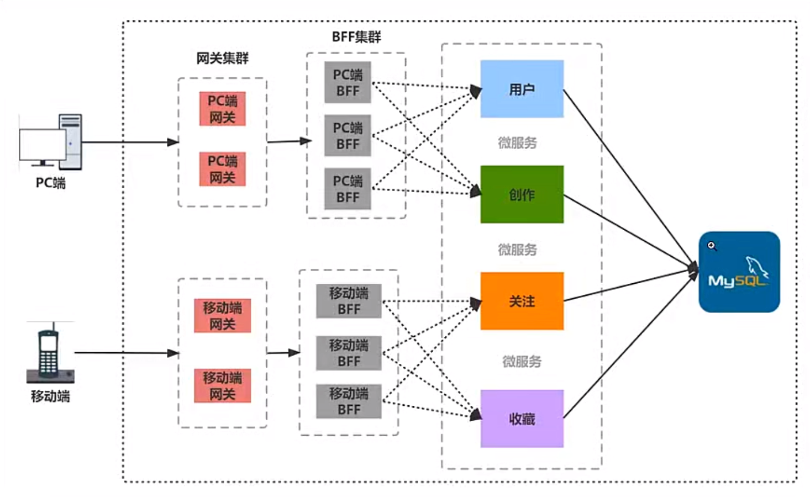

# BFF（Backend For Frontend）

- 微服务是一种架构模式, 它将单个应用程序划分为小的服务, 每个服务都独立运行并且可以使用不同的语言开发。这种架构模式使得应用程序变得更容易开发、维护。
- 微服务架构通常会有许多不同的服务, 这些服务可能位于不同的机器上, 因此需要使用某种通信协议来进行通信
- 因为 RPC 协议比 HTTP2 协议具有更低的延迟和更高的性能, 所以用的更多

## 作用

BFF 层的核心价值是为前端定制化处理数据（聚合、转换、转发）、简化前端请求逻辑、隔离前后端接口差异

## RPC（Remote Procedure Call，远程过程调用）协议

RPC 是一种用于远程过程调用的协议。
让你像调用本地函数一样，去调用远程服务方法的通信机制

`sofa-rpc-node`：是一个基于 Node.js 的 RPC 框架，支持多种协议。

`protocol Buffers`:  简称protobuf，是Google开发的一种数据序列化格式，可以将结构化的数据序列化成二进制数据，并支持多种语言进行解析。

logger: 日志
registry: 服务注册中心( zookeeper 管理服务注册、服务发现 )
server: 服务提供者

### 缓存
BFF 作为前端应用和后端系统之间的抽象层, 承担了大量的请求转发和数据转换工作。使用多级缓存可以帮助BFF 减少对后端系统的访问, 从而提高应用的响应速度

当 BFF 收到一个请求时,首先会检查内存缓存中是否存在对应的数据, 如果有就直接返回数据。如果内存缓存中没有数据, 就会检查Redis缓存, 如果Redis缓存中有数据返回数据, 并将数据写入内存缓存。如果本地缓存中也没有数据, 就会向后端系统发起请求, 并将数据写入Redis缓存和内存缓存

多级缓存
-多级缓存 (multi-level cache) 是指系统中使用了多个缓存层来存储数据的技术。这些缓存层的优先级通常是依次递减的, 即最快的缓存层位于最顶层, 最慢的缓存层位于底层

LRU
-LRU (Least Recently Used) 是一种常用的高速缓存淘汰算法, 它的原理是将最近使用过的数据或页面保留在缓存中, 而最少使用的数据或页面将被淘汰。这样做的目的为了最大化缓存的命中率, 即使使用缓存尽可能多地满足用户的请求

redis
Redis 是一种开源的内存数据存储系统, 可以作为数据库、缓存和消息中间件使用
Redis 运行在内存中, 因此它的读写速度非常快
ioredis 是一个基于 Node.js 的 Redis客户端, 提供了对 Redis 命令的高度封装和支持

### message queue
引入原因
在 BFF 中使用消息队列 (message queue) 有几个原因：
- 大并发：消息队列可以帮助应对大并发的请求，BFF 可以将请求写入消息队列，然后后端服务可以从消息队列中读取请求并处理
- 解耦：消息队列可以帮助解耦 BFF 和后端服务，BFF 不需要关心后端服务的具体实现，只需要将请求写入消息队列，后端服务负责从消息队列中读取请求并处理
- 异步：消息队列可以帮助实现异步调用，BFF 可以将请求写入消息队列，然后立即返回响应给前端应用，后端服务在后台处理请求
  - 流量削峰：消息队列可以帮助流量削峰，BFF 可以将请求写入消息队列，然后后端服务可以在合适的时候处理请求，从而缓解瞬时高峰流量带来的压力

RabbitMQ
RabbitMQ 是一个消息代理，它可以用来在消息生产者和消息消费者之间传递消息

RabbitMQ的工作流程如下：
- 消息生产者将消息发送到 RabbitMQ 服务器
- RabbitMQ 服务器将消息保存到队列中- 消息消费者从队列中读取消息
- 当消息消费者处理完消息后 RabbitMQ 服务器将消息删除

amqp：AMQP 是一个通用的消息协议，它定义了消息的格式和传输协议。

### serverless

- 无服务器架构几乎封装了所有底层资源管理和系统运维工作
- 服务器部署、扩容、运维、监控报警交由云服务器厂商来做
- 前端只开发关注业务，不需要关注服务器

云函数 SCF 组件（函数计算（FC））

API 网关组件
- API网关是将所有API的调用统一接入API网关层,由网关层负责接入和输出
- API网关是用户与服务器的连接器,负责API接口的托管,实现安全防护和统一监控。
- API网关组件是serverless-tencent 组件库中的基础组件之一,您可以通过该组件快速且方便地创建、配置和管理腾讯云的API网关产品。
- 通过API网关组件,您可以对一个API服务/接口进行完整的创建、配置、部署和删除等操作

### GraphQL
[GraphQL](https://graphql.cn/)
- graphql 既是一种用于 API 的查询语言也是一个满足你数据查询的运行时
- GraphQL 对你的 API 中的数据提供了一套易于理解的完整描述,使得客户端能够准确地获得它需要的数据、而且没有任何冗余
- 请求你所要的数据不多不少
- 只用一个请求获取多个资源

## 技术方案

Express + 常用中间件：异步支持更友好（async/await）、代码分层更清晰；生态略少于 Express

Koa2 + 洋葱模型 + 中间件： 异步支持更友好（async/await）、代码分层更清晰；生态略少于 Express

NestJS（TypeScript）：基于 TypeScript、模块化 / 装饰器设计、支持微服务；强规范，学习成本稍高

Egg.js/Midway.js（阿里）：内置企业级最佳实践（日志、监控、部署）、适配阿里生态；文档全中文

Serverless BFF（如阿里云 FC）： 无需运维服务器、按调用计费、自动扩缩容；需适配云厂商规范。Serverless 平台？

java springboot

## 流程

```
客户端
   ↓
bff-service（只给前端用）
   ↓
API Gateway
   ↓
后端微服务

or

客户端
   ↓
bff-service（只给前端用） + API Gateway
   ↓
后端微服务

```

## 解决哪些问题

1、是否只给 Web 用？还是多端？

2、认证方式 Cookie JWT Session

3、BFF 是否直连网关？

4、接口风格 REST GraphQL

5、权限是否在 BFF 层处理？

6、错误码是否统一？

接口聚合（多个后端 → 一个前端接口）

数据裁剪 / 转换（DTO → VO）

登录态 / token 处理

权限 & 菜单组装

前端友好的错误码

限流 / 简单缓存

解决 CORS / 网关绕行问题

观点
BFF = 谁离“前端变化”最近，就用谁

前端主导、页面变化快 → NestJS / Node

后端主导、业务编排重 → Spring Boot / Java

## 架构图


